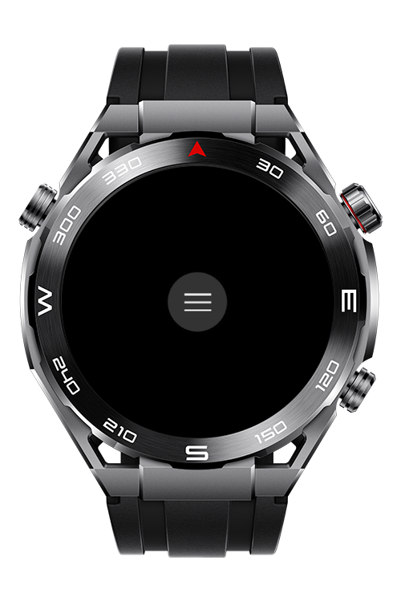
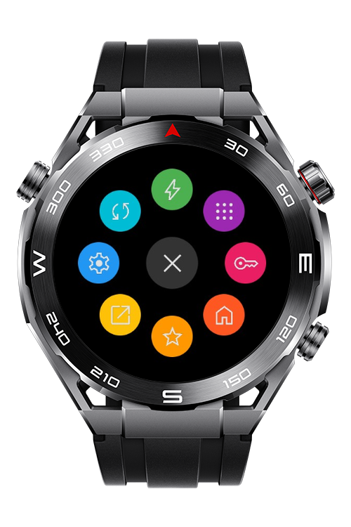

> **Note:** To access all shared projects, get information about environment setup, and view other guides, please visit [Explore-In-HMOS-Wearable Index](https://github.com/Explore-In-HMOS-Wearable/hmos-index).

#  **How To Create a Radial Menu on Lite Wearable**

HarmonyOS application that showing how a Radial Menu can be implemented on lite wearable devices.

<div>
    
    
</div>

# **Use Cases**

* A user can open the Radial Menu with a button press to quickly switch between frequently used apps on their smartwatch.
* The Radial Menu allows users to access and adjust key smartwatch settings like brightness, volume, and notifications with a single button press.


# **Tech Stack**

* **Languages**: JS
* **Frameworks**: HarmonyOS SDK 5.0.0(12)
* **Tools**: DevEco Studio Vers 5.1.0

# **Directory Structure**


```
entry/src/main/js/MainAbility
│    
└── pages/          
|     └── index.css
│     └── index.hml
│     └── index.js
└──  i18n
│     ├── en-US.json
│     └── zh-CN.json
└──  app.js #Constraints and Restrictions
```

# **Supported Devices** 

- Huawei Sport (Lite) Watch GT 4/5/6
- Huawei Sport (Lite) GT4/5 Pro
- Huawei Sport (Lite) Fit 3/4
- Huawei Sport (Lite) D2
- Huawei Sport (Lite) Ultimate

# **License**


**How To Create a Radial Menu on Lite Wearable** is distributed under the terms of the MIT License

See the [LICENSE](/LICENSE) for more information.

